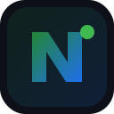

<p align="center">
  
</p>

<h1 align="center">nexa</h1>

<p align="center">
  <b>可接入的企业钉钉</b> · 开源企业协作 + 智能助手<br/>
  <sub>不是「旧 OA 对接钉钉」—— nexa 本身就是协作本体</sub>
</p>

<p align="center">
  <a href="docs/PRODUCT.md">Product</a> ·
  <a href="docs/GOAL.md">Roadmap</a> ·
  <a href="docs/STATUS.md">Status</a> ·
  <a href="docs/api/README.md">API</a> ·
  <a href="deploy/README.md">Deploy</a> ·
  <a href="CONTRIBUTING.md">Contributing</a>
</p>

---

## Why nexa

| 旧路 | nexa |
|------|------|
| OA + 钉钉双系统同步 | **一个产品本体** |
| 只能自用 | **企业注册接入（多租户）** |
| 十几个微服务端口 | **core 合并业务进程** |
| 聊天套壳 | **Skill / 感知 / 自动化** |

```
企业注册租户 ──► nexa ──► Agent
                  │
         组织·审批·待办·IM·工作台
                  │
         连接器：业务库 / 钉钉导入（可选）
```

## Architecture (simple)

```
┌─────────────┐   ┌──────────────┐   ┌─────────────┐
│ nexa-core   │   │ nexa-iam     │   │ nexa-agent  │
│ :48080      │◄──┤ :48081       │   │ :48091      │
│ gateway +   │   │ auth/tenant  │   │ NeoX (Node) │
│ all business│   └──────────────┘   └─────────────┘
└─────────────┘
 optional: cdc-mysql
```

**默认只跑 2 个 Go 进程 + 可选 Agent**，不浪费机器。

| Process | Port | Role |
|---------|------|------|
| **nexa-core** | 48080 | 网关 + HR/BPM/Business/ERP/Finance/IM/OP/AI/DataCenter |
| **nexa-iam** | 48081 | 登录 / 租户注册邀请（认证独立） |
| **nexa-agent** | 48091 | 对话大脑（NeoX，可选） |
| cdc-mysql | 6060 | 可选 CDC |

拆分服务源码仍在 `services/{hr,bpm,...}` 作对照；**部署优先 `services/core`**。

## Quick start

```bash
export PATH="/e/tools/go/bin:$PATH"
export GOTOOLCHAIN=local

./scripts/start-dev.sh
# :48081 iam  +  :48080 core
```

### Open a company

```bash
curl -s -X POST http://127.0.0.1:48080/v1/iam/tenants/register \
  -H "Content-Type: application/json" \
  -d '{"company":"Acme","adminUsername":"acme_admin","password":"pass123"}'

curl -s -X POST http://127.0.0.1:48080/v1/iam/login \
  -H "Content-Type: application/json" \
  -d '{"username":"acme_admin","password":"pass123"}'
```

### Admin console

浏览器打开 [http://127.0.0.1:48080/admin/](http://127.0.0.1:48080/admin/)  
默认演示账号 `boss` / `boss123`（可在控制台改密；密码 bcrypt 存储）。

### Smoke

```bash
./scripts/smoke.sh
```

### Agent (optional)

```bash
cd services/agent && cp .env.example .env
npm install && AGENT_USE_MOCK=true npm start
# via core proxy:
# POST http://127.0.0.1:48080/agent/run  Authorization: Bearer <token>
```

### Durable store (bolt)

```bash
export NEXA_DB_BACKEND=bolt
./scripts/start-dev.sh
```

### Mobile

```bash
cd apps/mobile
flutter pub get && flutter run
```

## API (via :48080)

| | |
|--|--|
| 注册企业 | `POST /v1/iam/tenants/register` |
| 登录 | `POST /v1/iam/login` |
| 邀请/加入 | `POST /v1/iam/invites` · `/invites/accept` |
| 角色模板 / 审计 | `GET /v1/iam/roles/templates` · `/v1/iam/audit` |
| 工作台 | `GET /v1/workbench/summary` |
| 审批流程目录 | `GET /v1/bpm/processes` |
| 技能 | `GET /v1/ai/skills` |
| 连接器 | `GET /v1/ai/connectors` |
| 审批待办 | `GET /v1/bpm/tasks/todo` |
| 员工 | `GET /v1/hr/employees` |
| 导出 | `GET /v1/data-center/templates` |
| Admin UI | `GET /admin/` |

业务路由：`Authorization: Bearer <token>`。

## Layout

```
nexa/
├── assets/logo.svg       # brand
├── apps/mobile           # Flutter
├── services/
│   ├── core/             # ★ merged business + gateway
│   ├── iam/              # ★ auth & tenant
│   ├── agent/            # NeoX
│   ├── cdc-mysql/        # optional
│   └── {hr,bpm,...}/     # reference only
├── docs/PRODUCT.md
└── scripts/start-dev.sh
```

## Env

| Var | Use |
|-----|-----|
| `NEXA_GATEWAY_URL` | Agent → core |
| `NEXA_DATA_DIR` | JSON data |
| `NEXA_DINGTALK_APP_KEY` | optional import |
| `GOTOOLCHAIN=local` | local Go |
| `NEXA_DB_BACKEND` | `file` (default) or `bolt` durable |
| `AGENT_USE_MOCK` | agent mock LLM |

## Status

部署 / 开发差距：**[docs/STATUS.md](docs/STATUS.md)**  
仓库规范：**[docs/CONVENTIONS.md](docs/CONVENTIONS.md)** · [CHANGELOG](CHANGELOG.md)

## Links

- https://github.com/lmk1010/nexa
- CDC: https://github.com/lmk1010/nexa-cdc-mysql
- Product: [docs/PRODUCT.md](docs/PRODUCT.md)

## License

[MIT](LICENSE)
